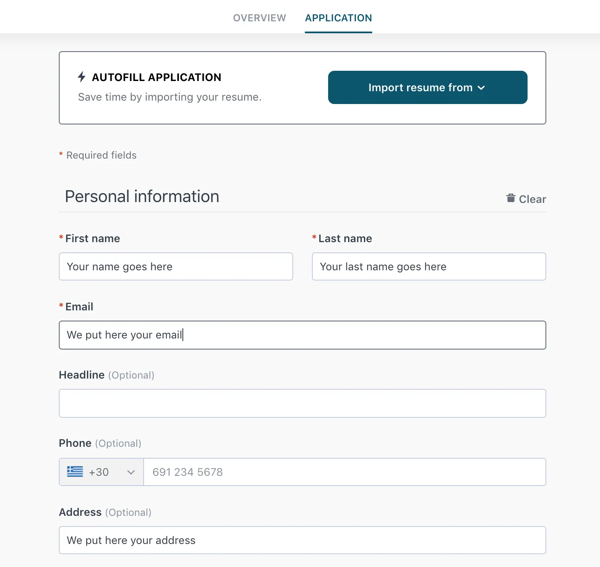

I want this to be implemented. 

The candidate should be logged in before giving an interview. 
The candidate first applies for a job before giving an interview.  
Like in this image there should be an interface like this, "Application" Table should be made for the same. 

The candidate applies for the job and HR approves this, only then can he access the interview link. For now make a single user schema with "role" if the role is candidate the user refers to the different application he has applied to. If it is HR, then he will refer to the jobs he has created, and those jobs contain the applications. 

The HR can approve or reject a user. 

First give me your plan, then your schema you designed get it approved before coding. 

Go step by step. 